```r
library(tidyverse) # This includes dplyr, stringr, ggplot2, .. 
```

```
## Warning: package 'tidyverse' was built under R version 4.2.3
```

```
## Warning: package 'ggplot2' was built under R version 4.2.3
```

```
## Warning: package 'tidyr' was built under R version 4.2.3
```

```
## Warning: package 'readr' was built under R version 4.2.3
```

```
## Warning: package 'purrr' was built under R version 4.2.3
```

```
## Warning: package 'stringr' was built under R version 4.2.3
```

```
## Warning: package 'forcats' was built under R version 4.2.3
```

```
## Warning: package 'lubridate' was built under R version 4.2.3
```

```
## ── Attaching core tidyverse packages ──────────────────────── tidyverse 2.0.0 ──
## ✔ dplyr     1.1.1     ✔ readr     2.1.4
## ✔ forcats   1.0.0     ✔ stringr   1.5.0
## ✔ ggplot2   3.4.2     ✔ tibble    3.2.1
## ✔ lubridate 1.9.2     ✔ tidyr     1.3.0
## ✔ purrr     1.0.1     
## ── Conflicts ────────────────────────────────────────── tidyverse_conflicts() ──
## ✖ dplyr::filter() masks stats::filter()
## ✖ dplyr::lag()    masks stats::lag()
## ℹ Use the ]8;;http://conflicted.r-lib.org/conflicted package]8;; to force all conflicts to become errors
```

```r
library(data.table)
```

```
## Warning: package 'data.table' was built under R version 4.2.3
```

```
## 
## Attaching package: 'data.table'
## 
## The following objects are masked from 'package:lubridate':
## 
##     hour, isoweek, mday, minute, month, quarter, second, wday, week,
##     yday, year
## 
## The following objects are masked from 'package:dplyr':
## 
##     between, first, last
## 
## The following object is masked from 'package:purrr':
## 
##     transpose
```

```r
library(rworldmap) # world map
```

```
## Warning: package 'rworldmap' was built under R version 4.2.3
```

```
## Loading required package: sp
```

```
## Warning: package 'sp' was built under R version 4.2.3
```

```
## Please note that 'maptools' will be retired during October 2023,
## plan transition at your earliest convenience (see
## https://r-spatial.org/r/2023/05/15/evolution4.html and earlier blogs
## for guidance);some functionality will be moved to 'sp'.
##  Checking rgeos availability: FALSE
## ### Welcome to rworldmap ###
## For a short introduction type : 	 vignette('rworldmap')
```

```r
library(ggthemes)
```

```
## Warning: package 'ggthemes' was built under R version 4.2.3
```

```r
library(reshape2) # melt: change data-frame format long/wide
```

```
## Warning: package 'reshape2' was built under R version 4.2.3
```

```
## 
## Attaching package: 'reshape2'
## 
## The following objects are masked from 'package:data.table':
## 
##     dcast, melt
## 
## The following object is masked from 'package:tidyr':
## 
##     smiths
```

```r
library(e1071) # skewness and kurtosis
```

```
## Warning: package 'e1071' was built under R version 4.2.3
```

```r
library(rvest)
```

```
## Warning: package 'rvest' was built under R version 4.2.3
```

```
## 
## Attaching package: 'rvest'
## 
## The following object is masked from 'package:readr':
## 
##     guess_encoding
```

```r
library(corrplot)
```

```
## Warning: package 'corrplot' was built under R version 4.2.3
```

```
## corrplot 0.92 loaded
```

```r
library(moments)
```

```
## 
## Attaching package: 'moments'
## 
## The following objects are masked from 'package:e1071':
## 
##     kurtosis, moment, skewness
```

```r
library(spatstat.geom)
```

```
## Warning: package 'spatstat.geom' was built under R version 4.2.3
```

```
## Loading required package: spatstat.data
```

```
## Warning: package 'spatstat.data' was built under R version 4.2.3
```

```
## spatstat.geom 3.2-1
## 
## Attaching package: 'spatstat.geom'
## 
## The following object is masked from 'package:data.table':
## 
##     shift
```

# **Solution:**

# 1.a. Loading the data via URL connection:


```r
democracy <- read_html("https://en.wikipedia.org/wiki/Democracy_Index")
all.tables = html_nodes(democracy, "table")  
regions <- as.data.frame(html_table(all.tables[4], fill = TRUE))
countries <- as.data.frame(html_table(all.tables[6], fill = TRUE))
components <- as.data.frame(html_table(all.tables[7], fill = TRUE))
head(regions,5)
```

```
##                            Region Coun.tries X2022 X2021 X2020 X2019 X2018
## 1                   North America          2  8.37  8.36  8.58  8.59  8.56
## 2                  Western Europe         21  8.36  8.23  8.29  8.35  8.35
## 3 Latin America and the Caribbean         24  5.79  5.83  6.09  6.13  6.24
## 4            Asia and Australasia         28  5.46  5.46  5.62  5.67  5.67
## 5      Central and Eastern Europe         28  5.39  5.36  5.36  5.42  5.42
##   X2017 X2016 X2015 X2014 X2013 X2012 X2011 X2010 X2008 X2006
## 1  8.56  8.56  8.56  8.59  8.59  8.59  8.59  8.63  8.64  8.64
## 2  8.38  8.40  8.42  8.41  8.41  8.44  8.40  8.45  8.61  8.60
## 3  6.26  6.33  6.37  6.36  6.38  6.36  6.35  6.37  6.43  6.37
## 4  5.63  5.74  5.74  5.70  5.61  5.56  5.51  5.53  5.58  5.44
## 5  5.40  5.43  5.55  5.58  5.53  5.51  5.50  5.55  5.67  5.76
```

```r
head(countries,5)
```

```
##           Region X2022.rank       Country      Regime.type X2022 X2021 X2020
## 1  North America         12        Canada   Full democracy  8.88  8.87  9.24
## 2  North America         30 United States Flawed democracy  7.85  7.85  7.92
## 3 Western Europe         20       Austria   Full democracy  8.20  8.07  8.16
## 4 Western Europe         36       Belgium Flawed democracy  7.64  7.51  7.51
## 5 Western Europe         37        Cyprus Flawed democracy  7.38  7.43  7.56
##   X2019 X2018 X2017 X2016 X2015 X2014 X2013 X2012 X2011 X2010 X2008 X2006
## 1  9.22  9.15  9.15  9.15  9.08  9.08  9.08  9.08  9.08  9.08  9.07  9.07
## 2  7.96  7.96  7.98  7.98  8.05  8.11  8.11  8.11  8.11  8.18  8.22  8.22
## 3  8.29  8.29  8.42  8.41  8.54  8.54  8.48  8.62  8.49  8.49  8.49  8.69
## 4  7.64  7.78  7.78  7.77  7.93  7.93  8.05  8.05  8.05  8.05  8.16  8.15
## 5  7.59  7.59  7.59  7.65  7.53  7.40  7.29  7.29  7.29  7.29  7.70  7.60
```

```r
head(components,5)
```

```
##               Rank
## 1                 
## 2 Full democracies
## 3                1
## 4                2
## 5                3
##   .mw.parser.output..tooltip.dotted.border.bottom.1px.dotted.cursor.help.Δ.Rank
## 1                                                                              
## 2                                                              Full democracies
## 3                                                                              
## 4                                                                              
## 5                                                                             2
##            Country      Regime.type    Overall.score          Δ.Score
## 1                                                                    
## 2 Full democracies Full democracies Full democracies Full democracies
## 3           Norway   Full democracy             9.81             0.06
## 4      New Zealand   Full democracy             9.61             0.14
## 5          Iceland   Full democracy             9.52             0.34
##   Elec.toral.pro.cessand.plura.lism Func.tioningof.govern.ment
## 1                                                             
## 2                  Full democracies           Full democracies
## 3                             10.00                       9.64
## 4                             10.00                       9.29
## 5                             10.00                       9.64
##   Poli.ticalpartici.pation Poli.ticalcul.ture  Civilliber.ties
## 1                                                             
## 2         Full democracies   Full democracies Full democracies
## 3                    10.00              10.00             9.41
## 4                    10.00               8.75            10.00
## 5                     8.89               9.38             9.71
```

# 1.b. Dominant countries in the democracy index


```r
countries_rate <- as.data.frame(countries)
top_countries <- countries_rate %>% select(Country, X2022) %>% arrange(desc(X2022)) %>% head(5)
bottom_countries <- countries_rate %>% select(Country, X2022) %>% arrange(X2022) %>% head(5)
Average <- rowMeans(countries_rate %>% select(-c(Region,X2022.rank,Country, Regime.type)))
top_countries_avg <- countries_rate %>% mutate(Average) %>% select(Country,Average) %>% arrange(desc(Average)) %>% head(5)
bottom_countries_avg <- countries_rate %>% mutate(Average) %>% select(Country, Average) %>% arrange(Average) %>% head(5)
```

Top countries in democracy index for 2022:


```r
top_countries
```

```
##       Country X2022
## 1      Norway  9.81
## 2 New Zealand  9.61
## 3     Iceland  9.52
## 4      Sweden  9.39
## 5     Finland  9.29
```

By 2006 -2022 Average:


```r
top_countries_avg
```

```
##       Country  Average
## 1      Norway 9.830667
## 2     Iceland 9.562000
## 3      Sweden 9.524667
## 4     Denmark 9.305333
## 5 New Zealand 9.268667
```

Lowest countries in democracy index for 2022:


```r
bottom_countries
```

```
##                    Country X2022
## 1              Afghanistan  0.32
## 2                  Myanmar  0.74
## 3              North Korea  1.08
## 4 Central African Republic  1.35
## 5                    Syria  1.43
```

By 2006 -2022 Average:


```r
bottom_countries_avg
```

```
##                    Country  Average
## 1              North Korea 1.062000
## 2                     Chad 1.569333
## 3 Central African Republic 1.581333
## 4                    Syria 1.700667
## 5             Turkmenistan 1.741333
```

# 2.a. Box plots by regions 


```r
p2 <- ggplot(countries)
p2 <- p2 + geom_boxplot(aes(x=Region, y=X2022)) +theme(text = element_text(size = 6))
p2
```

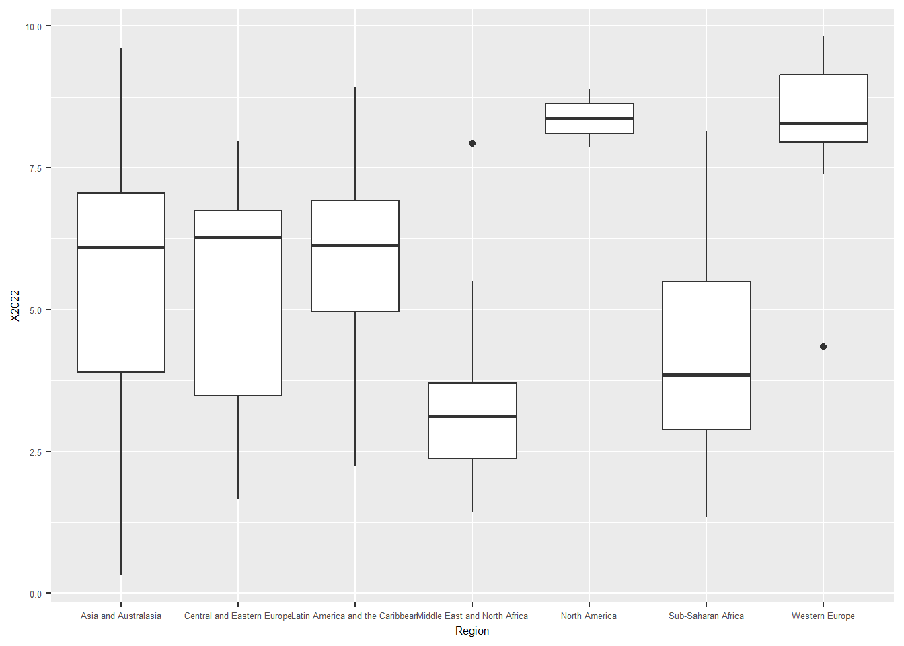

```r
p3 <- countries %>% select(Country,Region,X2022) %>% filter(Region == "Middle East and North Africa")
p4 <- countries %>% select(Country,Region,X2022) %>% filter(Region == "Western Europe")
out_3 <- boxplot.stats(p3$X2022)$out
out_ind_3 <- which(p3$X2022 %in% c(out_3))
out_4 <- boxplot.stats(p4$X2022)$out
out_ind_4 <- which(p4$X2022 %in% c(out_4))
p3[out_ind_3,]
```

```
##   Country                       Region X2022
## 6  Israel Middle East and North Africa  7.93
```

```r
p4[out_ind_4,]
```

```
##    Country         Region X2022
## 20  Turkey Western Europe  4.35
```

# 2.b. Regions density plots


```r
p5 <- ggplot(countries,aes(X2022)) + geom_density(alpha=.2, fill= "#00BFC4") + facet_wrap(~Region)
p5 
```

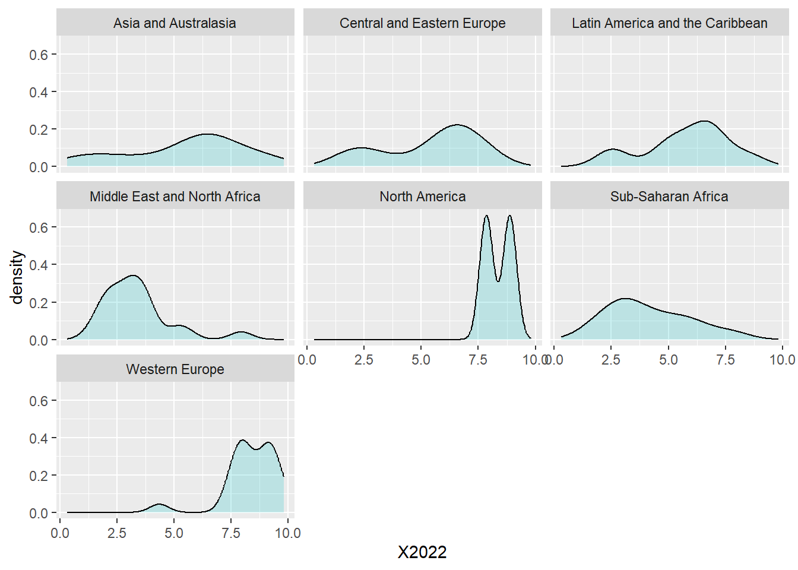

```r
p6 <- countries %>% 
     group_by(Region) %>%
     summarize(Mean = mean(X2022), Variance = var(X2022), Skewness = skewness(X2022), Kurtosis = kurtosis(X2022))
p6 
```

```
## # A tibble: 7 × 5
##   Region                           Mean Variance Skewness Kurtosis
##   <chr>                           <dbl>    <dbl>    <dbl>    <dbl>
## 1 Asia and Australasia             5.46    6.68    -0.529     2.32
## 2 Central and Eastern Europe       5.39    4.23    -0.649     1.99
## 3 Latin America and the Caribbean  5.79    3.40    -0.504     2.52
## 4 Middle East and North Africa     3.34    2.22     1.54      5.65
## 5 North America                    8.36    0.530    0         1   
## 6 Sub-Saharan Africa               4.14    3.18     0.506     2.37
## 7 Western Europe                   8.36    1.36    -1.86      7.64
```

From the density plots above, we can see that they don't resemble to the normal distribution. In addition we can see how the Skewness reflect in the plots, where Middle East and North Africa and Sub-Saharan Africa have the right tail as expected with positive Skewness. Moreover, we can see that the plots of the regions, apart from North America, have a negative Skewness. North America have a low variance and have no tail at all. It has Kurtosis of 1.

# 3.a. Democracy index between 2006-2022 in selected countries and regions


```r
Countries_graphs <- function(df, names){
  colnames <- colnames(df)
  if (sum(is.element(names, df$Region)) > 0) { x <- "Region" }
  else x <- "Country"
  
  y <-melt(df, id.vars = x)
  
  if (x == "Region"){
    y <- y %>% filter(Region %in% names)
    y <- y%>%  mutate(year = as.Date(as.character(ISOdate(as.numeric(gsub('X', '', variable)),12,31)))) %>% 
    filter(! year< "2006-12-31") %>% mutate(val = as.double(value))
    ggplot(y, aes(x = year, y =val)) + geom_line(aes(color = Region)) + labs(title="Democracy", 
         subtitle="Between the years 2006-2022",
         caption="Source: Wikipedia",
         x="Years",
         fill="Entities") 
  }
  else{
    y <- y %>% filter(Country %in% names)
    y <- y%>%  mutate(year = as.Date(as.character(ISOdate(as.numeric(gsub('X', '', variable)),12,31)))) %>% 
    filter(! year< "2006-12-31") %>% mutate(val = as.double(value))
    ggplot(y, aes(x = year, y =val)) + geom_line(aes(color = Country))+ labs(title="Democracy Index", 
         subtitle="Between the years 2006-2022",
         caption="Source: Wikipedia",
         x="Years",
         fill="Entities") }
}
Countries_graphs(countries, c("Israel", "India", "Germany","Iran","Indonesia"))
```

```
## Warning: There was 1 warning in `mutate()`.
## ℹ In argument: `year = as.Date(...)`.
## Caused by warning in `vapply()`:
## ! NAs introduced by coercion
```

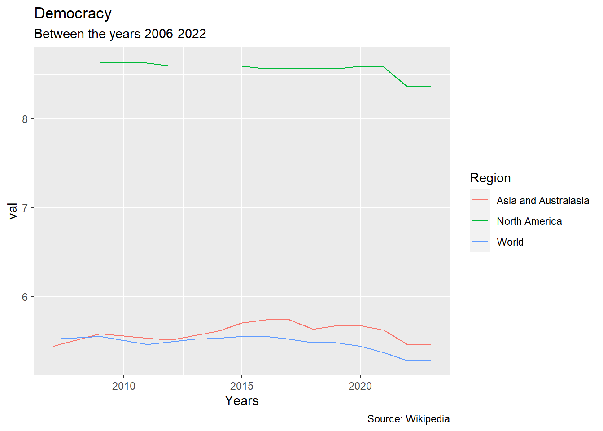

```r
Countries_graphs(regions,p6$Region)
```

```
## Warning: There was 1 warning in `mutate()`.
## ℹ In argument: `year = as.Date(...)`.
## Caused by warning in `vapply()`:
## ! NAs introduced by coercion
```

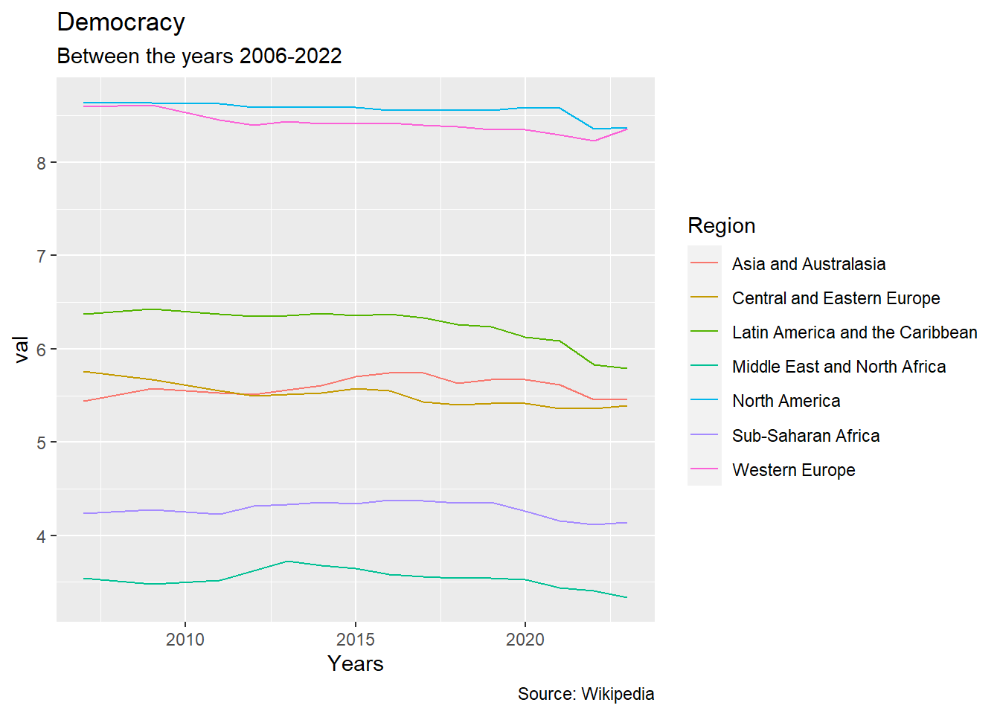

We can see that all the regions did not had any significant changes between 2006 to 2022.

# 3.b. Clustering Countries by their democracy index


```r
col <- colnames(countries)

max_value <- countries %>% select( colnames(countries)[which(col <= "X2022" & col >= "X2006")]) %>% apply( 1, max)
 min_value <- countries %>% select( colnames(countries)[which(col <= "X2022" & col >= "X2006")]) %>% apply( 1, min)
 
cntr <- countries %>% mutate(change = X2022 - X2006, max_value, min_value)


cntr1 <- cntr %>% filter(change >= 1.5)
clst1 <- cntr1$Country

cntr2 <- cntr %>% filter(change <= -1.5)
clst2 <- cntr2$Country

cntr3 <- cntr %>% filter(change >= 0.75 & change <= 1.5)
clst3 <- cntr3$Country

cntr4 <- cntr %>% filter(change <= -0.75 & change >= -1.5)
clst4 <- cntr4$Country

cntr5 <- cntr %>% mutate(min_ref = X2022 - min_value) %>% filter(change <= -0.75 & min_ref  >= 0.75)
clst5 <- cntr5$Country

cntr6 <- cntr %>% mutate(max_ref = X2022 - max_value) %>% filter(change >= 0.75 & max_ref  <= -0.75)
clst6 <- cntr6$Country

cntr7 <- cntr %>% mutate(Max_min = max_value -min_value) %>% filter(Max_min <= 0.5)
clst7 <- cntr7$Country

Country <- unique(c(clst1, clst2, clst3, clst4, clst5, clst6, clst7))
clst1_7 <- as.data.frame(Country)
cntr8 <- cntr %>% anti_join(clst1_7)
```

```
## Joining with `by = join_by(Country)`
```

```r
clst8 <- cntr8$Country

Countries_graphs(countries, clst1)
```

```
## Warning: There was 1 warning in `mutate()`.
## ℹ In argument: `year = as.Date(...)`.
## Caused by warning in `vapply()`:
## ! NAs introduced by coercion
```

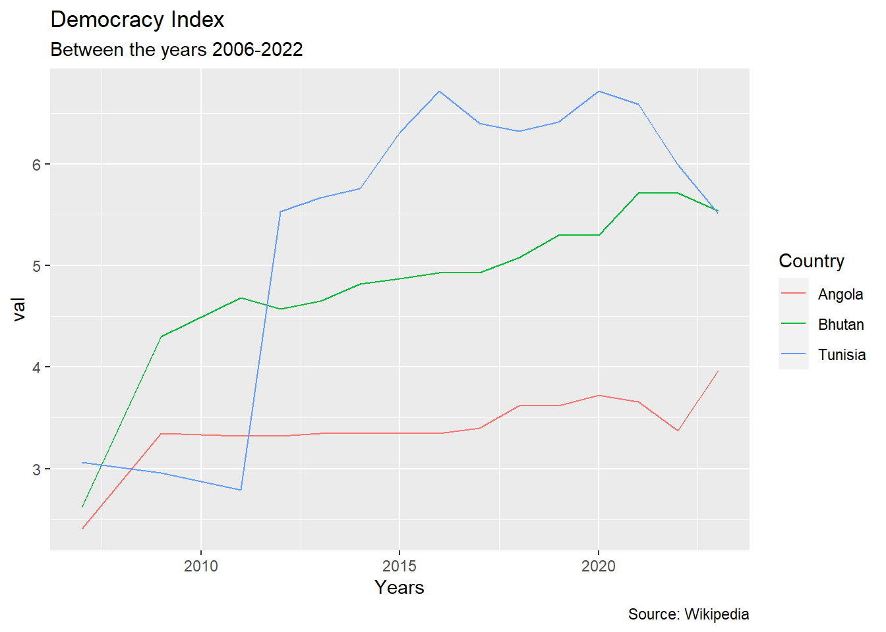

```r
Countries_graphs(countries, clst2)
```

```
## Warning: There was 1 warning in `mutate()`.
## ℹ In argument: `year = as.Date(...)`.
## Caused by warning in `vapply()`:
## ! NAs introduced by coercion
```

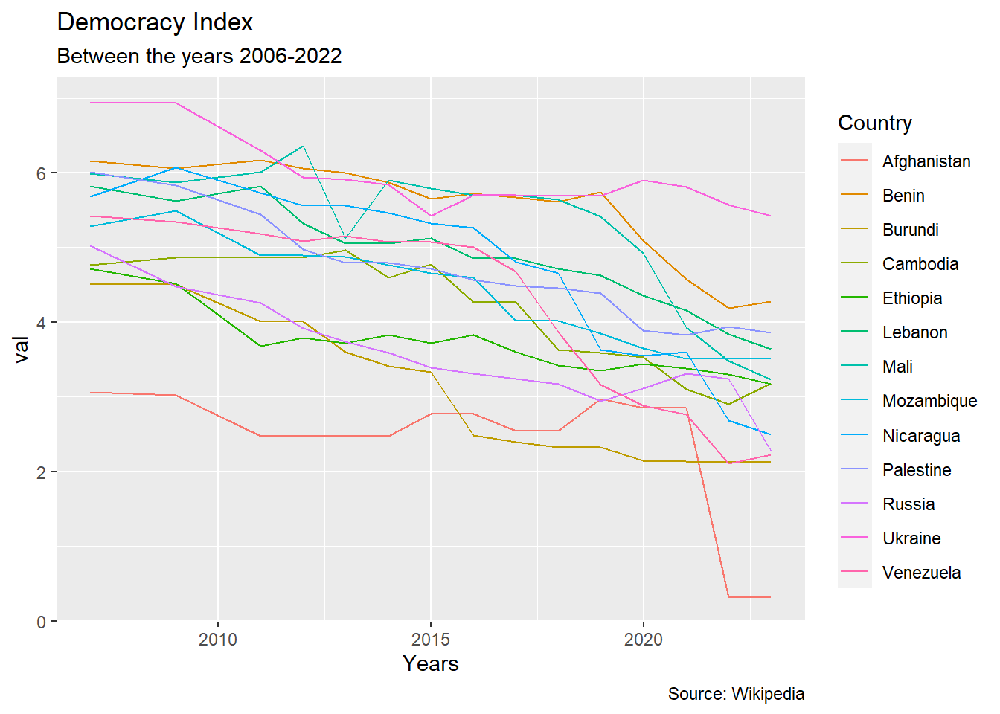

```r
Countries_graphs(countries, clst3)
```

```
## Warning: There was 1 warning in `mutate()`.
## ℹ In argument: `year = as.Date(...)`.
## Caused by warning in `vapply()`:
## ! NAs introduced by coercion
```

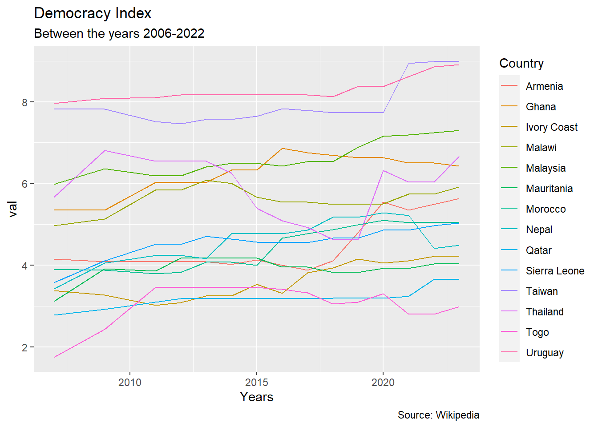

```r
Countries_graphs(countries, clst4)
```

```
## Warning: There was 1 warning in `mutate()`.
## ℹ In argument: `year = as.Date(...)`.
## Caused by warning in `vapply()`:
## ! NAs introduced by coercion
```

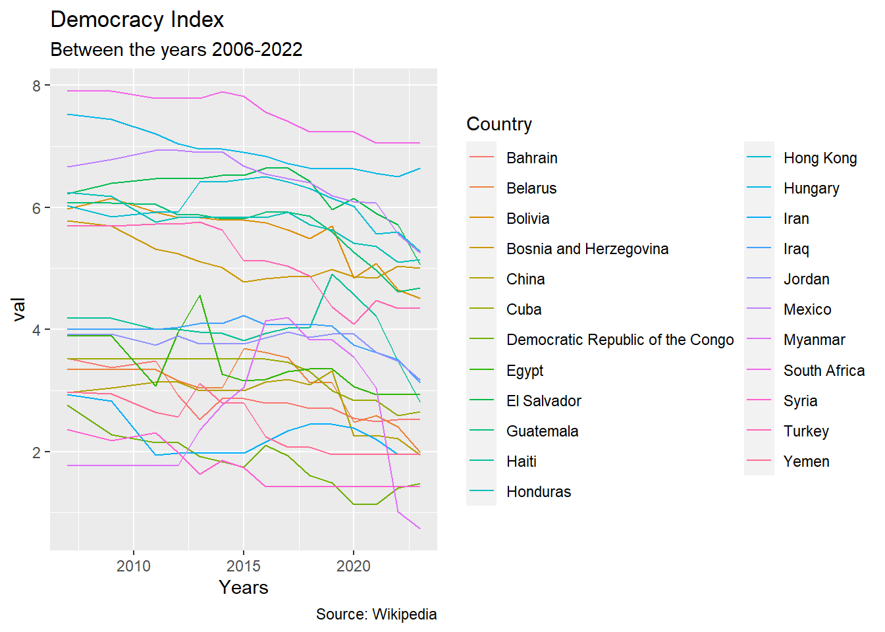

```r
Countries_graphs(countries, clst5)
```

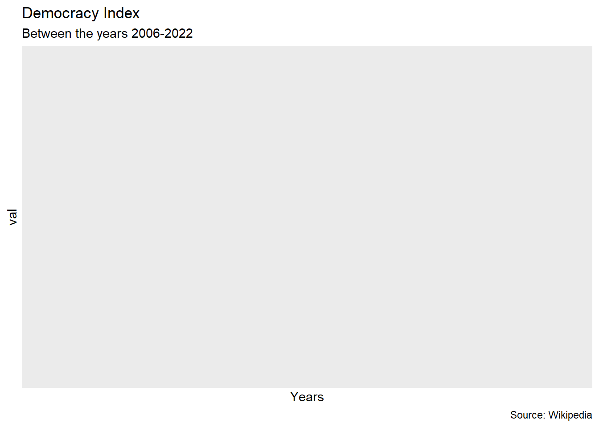

```r
Countries_graphs(countries, clst6)
```

```
## Warning: There was 1 warning in `mutate()`.
## ℹ In argument: `year = as.Date(...)`.
## Caused by warning in `vapply()`:
## ! NAs introduced by coercion
```

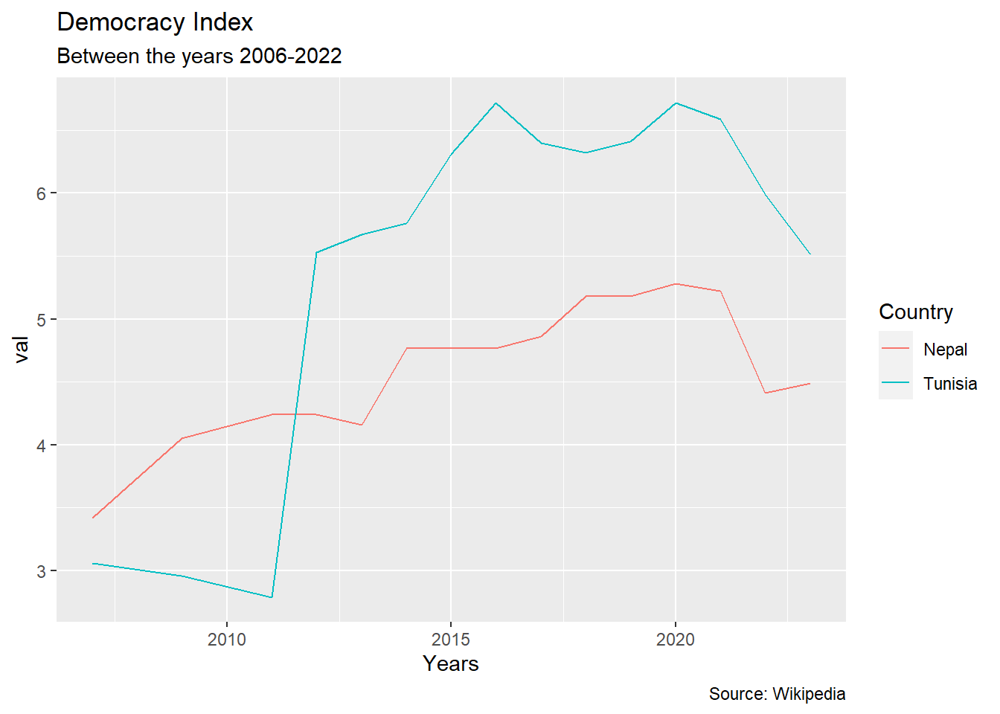

```r
Countries_graphs(countries, clst7)
```

```
## Warning: There was 1 warning in `mutate()`.
## ℹ In argument: `year = as.Date(...)`.
## Caused by warning in `vapply()`:
## ! NAs introduced by coercion
```

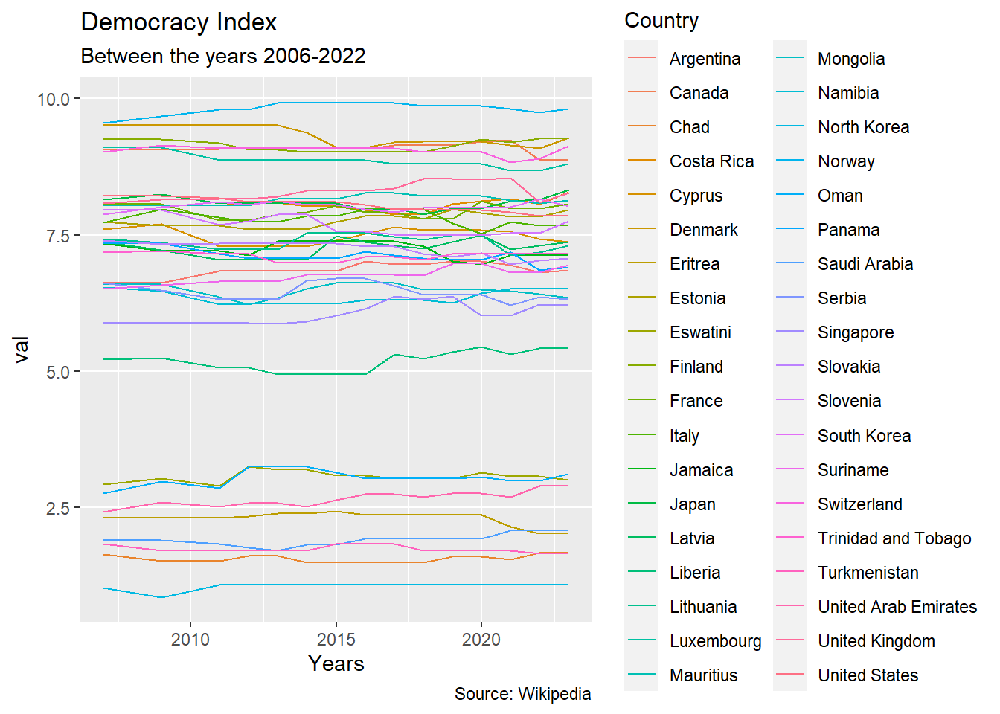

```r
Countries_graphs(countries, clst8)
```

```
## Warning: There was 1 warning in `mutate()`.
## ℹ In argument: `year = as.Date(...)`.
## Caused by warning in `vapply()`:
## ! NAs introduced by coercion
```

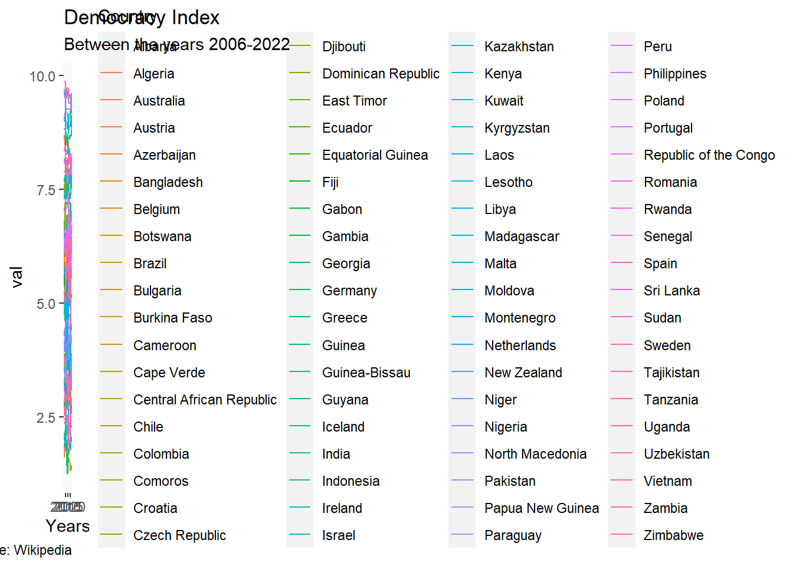

**Now we will analyze all the clusters**:  
cluster 1 - we can see a pattern of improvement in democracy index.  
cluster 2 - we can see a pattern of deterioration in democracy index.  
cluster 3 - we can see a slight improvement in democracy index.  
cluster 4 - we can see a slight deterioration in democracy index.  
cluster 5 - this plot have no country at all.  
cluster 6 - we can see a pattern of improvement at first but then deterioration. a big change in the democracy index indicates an unstable regimes.  
cluster 7 - we can see many countries that all most did not change in their democracy index, because of a stable regimes.  
cluster 8 - we can see that most of the countries are in this cluster, because it is a problem to analyze and understand any pattern.

# 4. **Regimes democratic mobility**


```r
index_2006 <- countries$X2006
regime_2006_type <- c('Full democracy','Flawed democracy','Hybrid regime','Authoritarian')


regime_mobility <- countries %>% mutate(regime_2006 = regime_2006_type[(X2006<=10&X2006>=8)+ 2*(X2006 <8 & X2006 >= 6) + 3*(X2006 < 6 & X2006 >=4) +4*(X2006 < 4 & X2006 >=0)])
                  
regime_mobility <- regime_mobility %>% mutate(regime_pairs = paste(Regime.type,regime_2006))
rgm_prb <- matrix(c(1:16),ncol = 4,byrow = TRUE)
colnames(rgm_prb) <- paste(regime_2006_type) #Regime type in 2022
rownames(rgm_prb) <- regime_2006_type #Regime type in 2006
for (i in colnames(rgm_prb)){
  for (j in rownames(rgm_prb)){
    rgm_prb[j,i] <- length(which(regime_mobility$regime_pairs %in% paste(j,i)))/length(which(regime_mobility$Regime.type %in% i))
  }
} 
heatmap(rgm_prb)
```

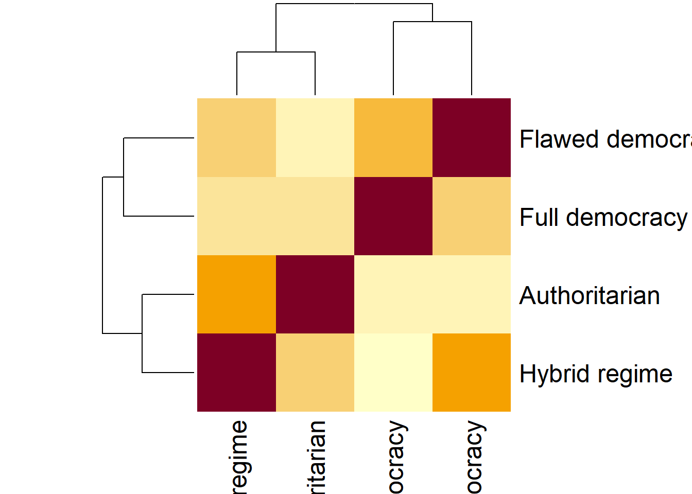

We can see in this heat probability map, that as expected - the chances to move from non democratic regime to democratic one is low, and higher if the regime type is similar to the current regime type.

# 5.a. **Joining more data together**


```r
# Load GDP table
gdp_page <- read_html("https://en.wikipedia.org/wiki/List_of_countries_by_GDP_(PPP)_per_capita")
gdp_tables <- html_nodes(gdp_page, "table")
gdp_df <- as.data.frame(html_table(gdp_tables[2], fill = TRUE))
colnames(gdp_df) <- paste(colnames(gdp_df), "-", gdp_df[1,])
colnames(gdp_df)[1] <- "Country"
gdp_df$Country <- gsub("\\\u202F\\*", "",gdp_df$Country)
gdp_df$`CIA.8..9..10. - Estimate` <- as.double(gsub(",", "", gdp_df$`CIA.8..9..10. - Estimate`))
```

```
## Warning: NAs introduced by coercion
```

```r
# Load population size table
population_page <- read_html("https://en.wikipedia.org/wiki/List_of_countries_and_dependencies_by_population")
population_table <- html_table(html_nodes(population_page, "table")[[2]])
population_df <- data.frame(population_table)
colnames(population_df) <- population_df[1,]
colnames(population_df)[2] <- "Country"
population_df$Numbers <- as.double(gsub(",","", population_df$Numbers))
```

```
## Warning: NAs introduced by coercion
```

```r
# Load incarceration rates table
incarceration_page <- read_html("https://en.wikipedia.org/wiki/List_of_countries_by_incarceration_rate")
incarceration_table <- html_table(html_nodes(incarceration_page, "table")[[2]])
incarceration_df <- data.frame(incarceration_table)
colnames(incarceration_df)[1] <- "Country"
incarceration_df$Country <- gsub("\\s\\[Note]", "", incarceration_df$Country)
incarceration_df$Country <- gsub("\\\u202F\\*", "",incarceration_df$Country)
incarceration_df$Rate.per.100.000..3. <- as.double(gsub(",", "", incarceration_df$Rate.per.100.000..3.))
```

```
## Warning: NAs introduced by coercion
```

```r
# Load area table
area_page <- read_html("https://en.wikipedia.org/wiki/List_of_countries_and_dependencies_by_area")
area_table <- html_table(html_nodes(area_page, "table")[[2]])
area_df <- data.frame(area_table)
colnames(area_df)[2] <- "Country"
area_df$Landin.km2..mi2.<- gsub("\\s\\(.*", "", area_df$Landin.km2..mi2.)
area_df$Landin.km2..mi2.<- as.double(gsub(",", "", area_df$Landin.km2..mi2.))
```

```
## Warning: NAs introduced by coercion
```

```r
# Join tables using country names
joined_table <- countries %>%
  full_join(gdp_df, by = c("Country" = "Country")) %>%
  full_join(population_df, by = c("Country" = "Country")) %>%
  full_join(incarceration_df, by = c("Country" = "Country")) %>%
  full_join(area_df, by = c("Country" = "Country"))

# Display top five rows of the joined table
head(joined_table, 5)
```

```
##         Region.x X2022.rank       Country      Regime.type X2022 X2021 X2020
## 1  North America         12        Canada   Full democracy  8.88  8.87  9.24
## 2  North America         30 United States Flawed democracy  7.85  7.85  7.92
## 3 Western Europe         20       Austria   Full democracy  8.20  8.07  8.16
## 4 Western Europe         36       Belgium Flawed democracy  7.64  7.51  7.51
## 5 Western Europe         37        Cyprus Flawed democracy  7.38  7.43  7.56
##   X2019 X2018 X2017 X2016 X2015 X2014 X2013 X2012 X2011 X2010 X2008 X2006
## 1  9.22  9.15  9.15  9.15  9.08  9.08  9.08  9.08  9.08  9.08  9.07  9.07
## 2  7.96  7.96  7.98  7.98  8.05  8.11  8.11  8.11  8.11  8.18  8.22  8.22
## 3  8.29  8.29  8.42  8.41  8.54  8.54  8.48  8.62  8.49  8.49  8.49  8.69
## 4  7.64  7.78  7.78  7.77  7.93  7.93  8.05  8.05  8.05  8.05  8.16  8.15
## 5  7.59  7.59  7.59  7.65  7.53  7.40  7.29  7.29  7.29  7.29  7.70  7.60
##   UN.Region - UN Region IMF.5..6. - Estimate IMF.5..6..1 - Year
## 1              Americas               60,177               2023
## 2              Americas               80,035               2023
## 3                Europe               69,502               2023
## 4                Europe               65,501               2023
## 5                  Asia               54,611          [n 2]2023
##   World.Bank.7. - Estimate World.Bank.7..1 - Year CIA.8..9..10. - Estimate
## 1                   52,085                   2021                    47900
## 2                   69,288                   2021                    63700
## 3                   58,431                   2021                    54100
## 4                   58,905                   2021                    51700
## 5                   44,110              [n 2]2021                    41700
##   CIA.8..9..10..1 - Year Rank.x   Numbers % of the world        Date
## 1                   2021     37  39999403         0.498% 16 Jun 2023
## 2                   2021      3 334895000          4.17% 16 Jun 2023
## 3                   2021     98   9120091         0.113%  1 Apr 2023
## 4                   2021     81  11755313         0.146%  1 Apr 2023
## 5              [n 2]2021    157    918100        0.0114%  1 Oct 2021
##   Source (official or from the United Nations) Notes.x Region.y  Count.2.
## 1                National population clock[40]         Americas    32,261
## 2                 National population clock[7]     [d] Americas 1,675,400
## 3              National quarterly estimate[97]           Europe     8,645
## 4                        Official estimate[80]           Europe    10,614
## 5         2021 census preliminary results[153]     [y]     Asia       716
##   Rate.per.100.000..3. Male.....a. Female.....4. National.....b. Foreign.....5.
## 1                   85        94.4           5.6               —              —
## 2                  505        89.8          10.2            92.7            7.3
## 3                   96        93.4           6.6            46.8           53.2
## 4                   91        95.6           4.4            55.8           44.2
## 5                   80        94.6           5.4            53.7           46.3
##   Occupancy.....6. Remand.....7.         Rank.y     Totalin.km2..mi2.
## 1            102.2          39.0              2 9,984,670 (3,855,100)
## 2             95.6          23.3 3 or 4[Note 5] 9,833,517 (3,796,742)
## 3             95.7          21.0            113       83,871 (32,383)
## 4            120.6          37.6            136       30,528 (11,787)
## 5            108.8          32.4            162         9,251 (3,572)
##   Landin.km2..mi2. Waterin.km2..mi2. X.water   Notes.y
## 1          9093507 891,163 (344,080)     8.9  [Note 4]
## 2          9147593 685,924 (264,837)     7.0  [Note 7]
## 3            82445       1,426 (551)     1.7          
## 4            30278          250 (97)     0.8          
## 5             9241          10 (3.9)     0.1 [Note 87]
```

# 5.b. **Simple linear regression**


```r
dem_gdp <- joined_table %>% select(dem_index = X2022, cia_gdp = `CIA.8..9..10. - Estimate`, incarceration = Rate.per.100.000..3.) 
dem_gdp_lmodel <- lm(cia_gdp ~ dem_index, data = dem_gdp)  #Fitting a linear model
summary(dem_gdp_lmodel)
```

```
## 
## Call:
## lm(formula = cia_gdp ~ dem_index, data = dem_gdp)
## 
## Residuals:
##    Min     1Q Median     3Q    Max 
## -27148 -11701  -3187   6754  80120 
## 
## Coefficients:
##             Estimate Std. Error t value Pr(>|t|)    
## (Intercept)  -6166.1     3551.0  -1.736   0.0844 .  
## dem_index     5152.2      609.2   8.457 1.48e-14 ***
## ---
## Signif. codes:  0 '***' 0.001 '**' 0.01 '*' 0.05 '.' 0.1 ' ' 1
## 
## Residual standard error: 18440 on 163 degrees of freedom
##   (148 observations deleted due to missingness)
## Multiple R-squared:  0.305,	Adjusted R-squared:  0.3007 
## F-statistic: 71.52 on 1 and 163 DF,  p-value: 1.481e-14
```

```r
plot(dem_gdp$dem_index, dem_gdp$cia_gdp, pch = 16, main = "GDP PLOTTED AGAINST DEMOCRACY INDEX", xlab = "DEMOCRACY INDEX", ylab = "GDP", col = "blue") #plotting gdp and democracy index
abline(dem_gdp_lmodel, col = "purple", pch = 30, cex = 2)
```

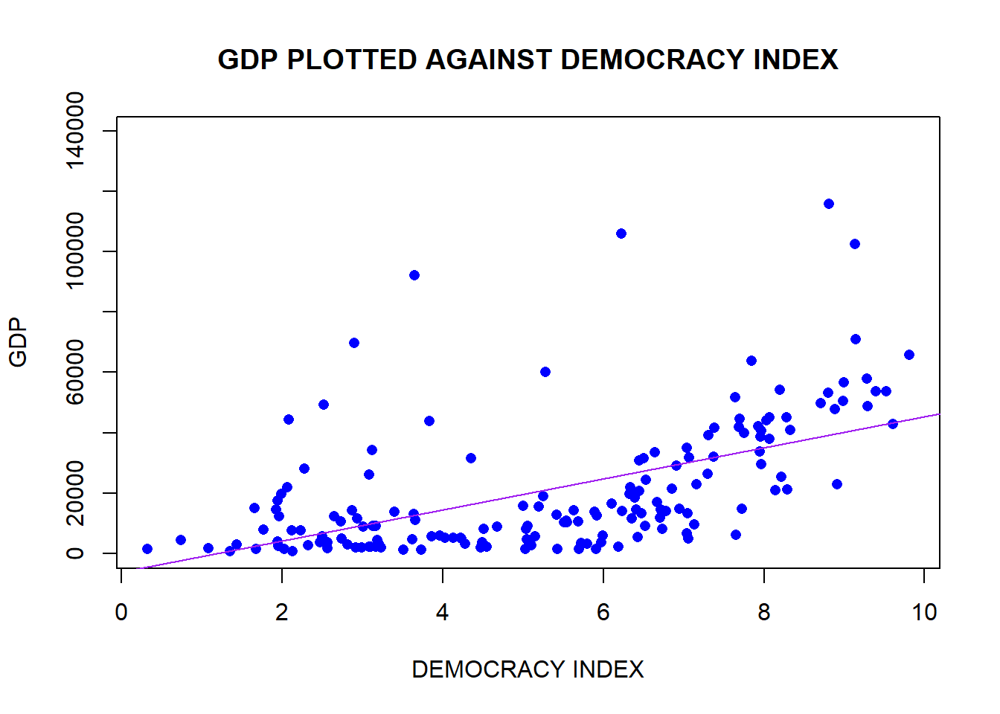

```r
dem_incar_lmodel <- lm(incarceration ~ dem_index, data = dem_gdp)
summary(dem_incar_lmodel)
```

```
## 
## Call:
## lm(formula = incarceration ~ dem_index, data = dem_gdp)
## 
## Residuals:
##     Min      1Q  Median      3Q     Max 
## -133.24  -82.65  -34.80   39.03  449.84 
## 
## Coefficients:
##             Estimate Std. Error t value Pr(>|t|)    
## (Intercept)  155.795     22.556   6.907 1.12e-10 ***
## dem_index     -0.125      3.853  -0.032    0.974    
## ---
## Signif. codes:  0 '***' 0.001 '**' 0.01 '*' 0.05 '.' 0.1 ' ' 1
## 
## Residual standard error: 114 on 159 degrees of freedom
##   (152 observations deleted due to missingness)
## Multiple R-squared:  6.617e-06,	Adjusted R-squared:  -0.006283 
## F-statistic: 0.001052 on 1 and 159 DF,  p-value: 0.9742
```

```r
plot(x = dem_gdp$dem_index, y = dem_gdp$incarceration, pch = 16, main = "INCARCERATION PLOTTED AGAINST DEMOCRACY INDEX", xlab = "DEMOCRACY INDEX", ylab = "INCARCERATION (per 100,000)", col = "red")
abline(dem_incar_lmodel, col = "orange", pch = 30, cex = 2)
```

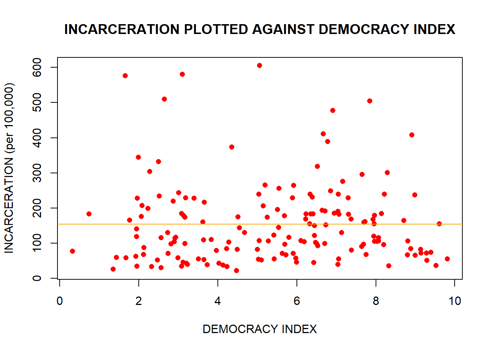

The first plot of linear regression (the blue dots) - GDP explained by democracy index. We can see some linear connection between the variables and we have few high GDP with respectively low democracy index. The second plot (the red dots) - Incarceration explained with democracy index. We can see there is no correlation between this two.

# 6.a. **Empirical Cumulative Distribution Functions**


```r
X <- gdp_df$`CIA.8..9..10. - Estimate`
x_ecdf <- ecdf(X)
plot(x_ecdf,main = "GDP (PPP) per capita of a randomly selected country", xlab = "GDP", ylab = "F(X)")
```

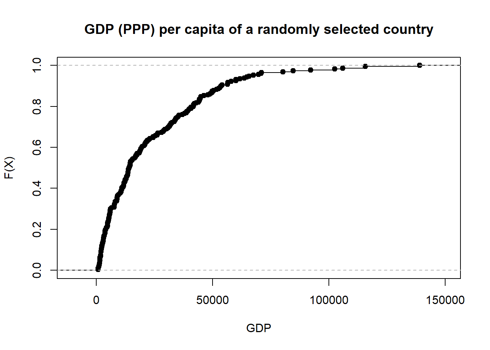

We can see the the ECDF of GDP per country. Approximately 90% of the countries have less than 50,000$ GDP per capita. 

#6.b.


```r
Y_data <- joined_table %>% select(Country, gdp = `CIA.8..9..10. - Estimate`, population = Numbers) %>% filter(! is.na(gdp) & ! is.na(population)) %>% mutate(weighted_pop = population/sum(population, na.rm = TRUE))
Y_weighted_pop <- Y_data$weighted_pop
Y_gdp <- Y_data$gdp
Y_ecdf <- ewcdf(Y_gdp, Y_weighted_pop )
plot(Y_ecdf,main = "GDP (PPP) per capita of a randomly selected person", xlab = "GDP", ylab = "F(Y)")
```

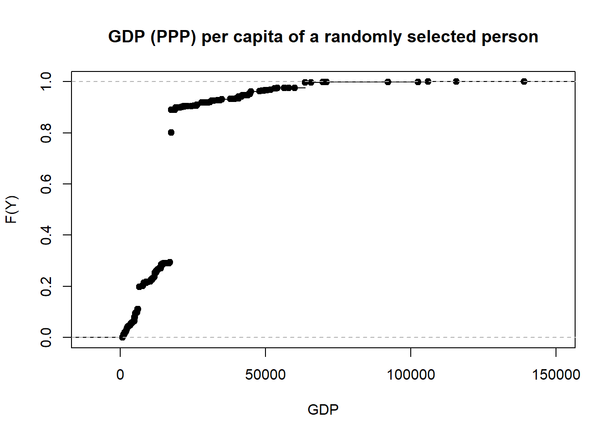

We can see here the differences between X plot(6.a) to Y plot (6.b), whereas Y reflects more accurately the GDP around the world - 90% of people are below 30,000 GDP per year, very low productivity.

# 6.c.


```r
Z_data <- joined_table %>% select(Country, area = Landin.km2..mi2., gdp = `CIA.8..9..10. - Estimate`) %>% filter(! is.na(area) & ! is.na(gdp)) %>% mutate(weighted_area = area / sum(area, na.rm = TRUE))
Z_weighted_area <- Z_data$weighted_area
Z_gdp <- Z_data$gdp
Z_ecdf <- ewcdf(Z_gdp, Z_weighted_area)
plot(Z_ecdf,main = "GDP (PPP) per capita of a randomly selected area", xlab = "GDP", ylab = "F(Z)")
```

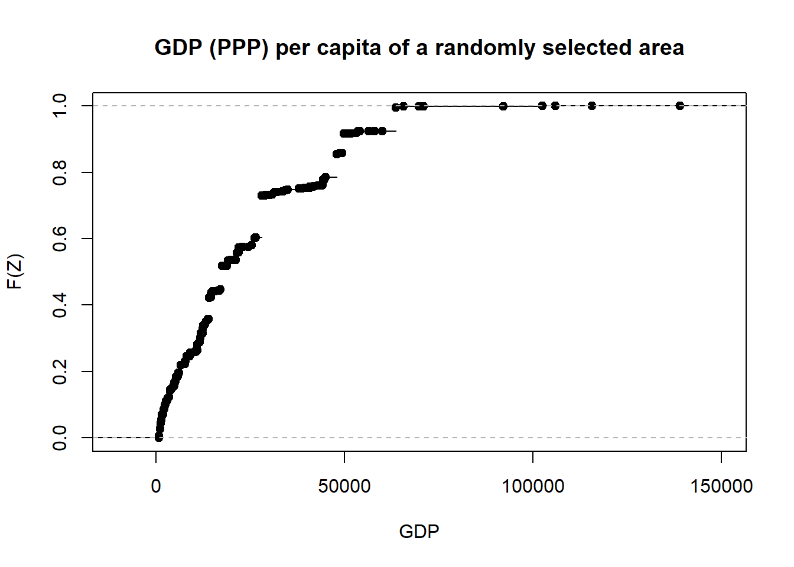

This plot similar to X plot (6.a) more then Y plot because it is plot of the GDP around regions and not peoples, it is more close to countries.

# 7. **Mapping democarcy index**


```r
country_numeric <- apply(countries[,5:19], 2, as.numeric)
country_slim_lst <- data.table(select(countries, X2022.rank, Country, X2022))
tmp_heat <-rowMeans(country_numeric[,-1:-4]) 
country_slim_lst <- mutate(.data = country_slim_lst, avg = tmp_heat)
countries_avg_rating = arrange(country_slim_lst, Country)

#we need to replace Eswatini with Swaziland
countries_avg_rating$Country = gsub("Eswatini", "Swaziland", countries_avg_rating$Country)

#again here we need to replace North Macedonia with Macedonia
countries_avg_rating$Country = gsub("North Macedonia", "Macedonia", countries_avg_rating$Country)

#using the join function to join all the tables:
heat_map_dat = joinCountryData2Map(countries_avg_rating, joinCode="NAME", nameJoinColumn="Country", verbose = TRUE)
```

```
## 167 codes from your data successfully matched countries in the map
## 0 codes from your data failed to match with a country code in the map
##      failedCodes failedCountries
## 76 codes from the map weren't represented in your data
```

```r
#the white countrys are those who does not have an index of democracy
mapCountryData(heat_map_dat, nameColumnToPlot = "avg", mapTitle = "Average democracy index by Country", addLegend = TRUE)
```

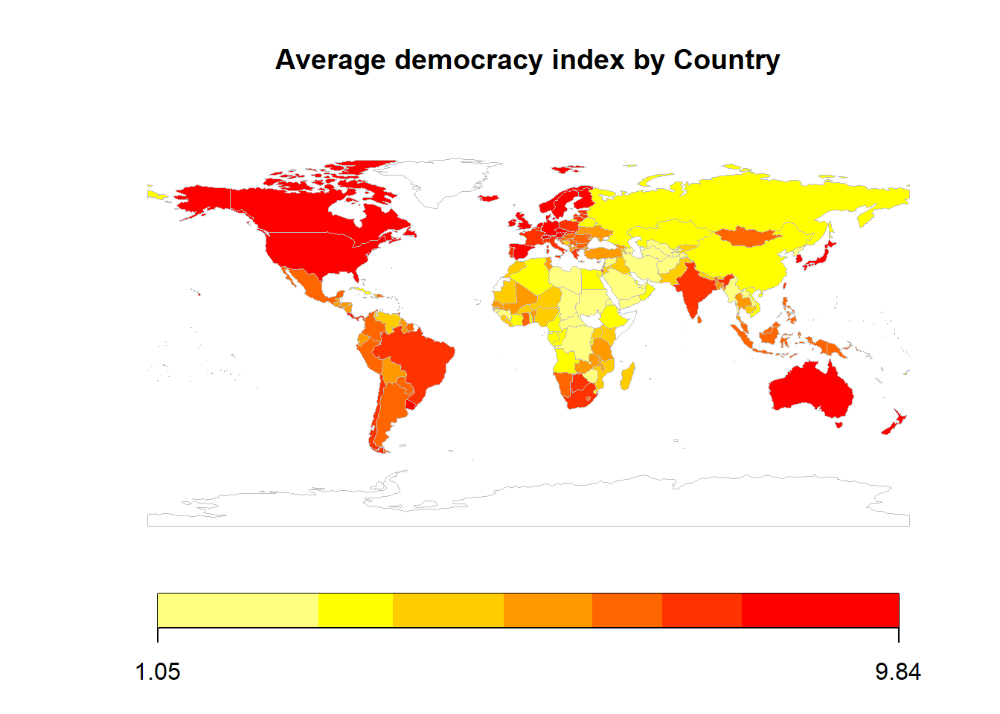

```r
#now we will repeat this function to show the differences between 2006 and 2022:

countries$Country = gsub("Eswatini", "Swaziland", countries$Country)
countries$Country = gsub("North Macedonia", "Macedonia", countries$Country)
democracy_index = countries %>% select(Country, X2022, X2006) %>%
  mutate(Difference = (X2022 - X2006)) %>% arrange(Country)

dimocracymaps_heat = joinCountryData2Map(democracy_index, joinCode="NAME", nameJoinColumn="Country", verbose = TRUE)
```

```
## 167 codes from your data successfully matched countries in the map
## 0 codes from your data failed to match with a country code in the map
##      failedCodes failedCountries
## 76 codes from the map weren't represented in your data
```

```r
mapCountryData(dimocracymaps_heat, nameColumnToPlot = "Difference", mapTitle = "The difference index between 2022 to 2006 of democracy", addLegend = TRUE)
```

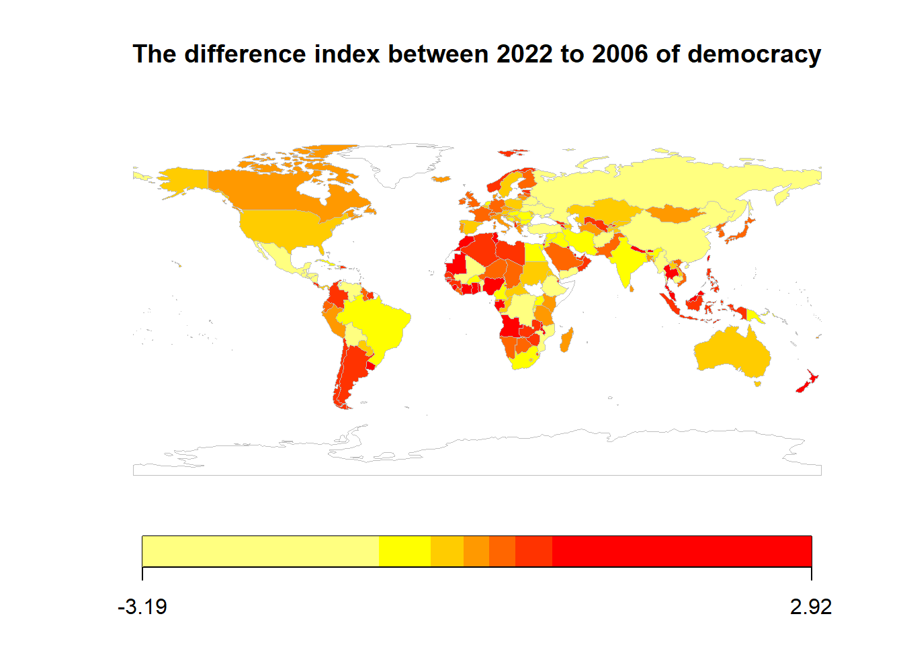

At the first heat map of the world we can see that the western world is more democratic then the eastern side (except Australia and most of Europe). The second heat map show the difference index between 2022 to 2006. we can see that the south world became more democratic.

# 8.a. **Democracy components**


```r
#we will change the columns names
colnames(components) <- c("Rank", "chage_in_rank", "Country",  "Regime_type", "Overall_score", "chage_in_score", "Electoral_process_and_pluralism", "Functioning_of_government", "Political_participation", "Political_culture", "Civil_liberties")

# Removing all the "Na" cells
components <- components[complete.cases(components), ]

#Using the Union for all columns, as numeric
components_numeric <- c("Electoral_process_and_pluralism", "Functioning_of_government", "Political_participation", "Political_culture", "Civil_liberties")

# Using the as.numeric function to verify its all numeric
components[, components_numeric] <- sapply(components[, components_numeric], as.numeric)
```

```
## Warning in lapply(X = X, FUN = FUN, ...): NAs introduced by coercion

## Warning in lapply(X = X, FUN = FUN, ...): NAs introduced by coercion

## Warning in lapply(X = X, FUN = FUN, ...): NAs introduced by coercion

## Warning in lapply(X = X, FUN = FUN, ...): NAs introduced by coercion

## Warning in lapply(X = X, FUN = FUN, ...): NAs introduced by coercion
```

```r
#Using the merge function to merge all the columns
total_data <- joined_table %>% full_join(components, by = c("Country" = "Country"))

#Display the top 5 rows:
head(total_data, 5)
```

```
##         Region.x X2022.rank       Country      Regime.type X2022 X2021 X2020
## 1  North America         12        Canada   Full democracy  8.88  8.87  9.24
## 2  North America         30 United States Flawed democracy  7.85  7.85  7.92
## 3 Western Europe         20       Austria   Full democracy  8.20  8.07  8.16
## 4 Western Europe         36       Belgium Flawed democracy  7.64  7.51  7.51
## 5 Western Europe         37        Cyprus Flawed democracy  7.38  7.43  7.56
##   X2019 X2018 X2017 X2016 X2015 X2014 X2013 X2012 X2011 X2010 X2008 X2006
## 1  9.22  9.15  9.15  9.15  9.08  9.08  9.08  9.08  9.08  9.08  9.07  9.07
## 2  7.96  7.96  7.98  7.98  8.05  8.11  8.11  8.11  8.11  8.18  8.22  8.22
## 3  8.29  8.29  8.42  8.41  8.54  8.54  8.48  8.62  8.49  8.49  8.49  8.69
## 4  7.64  7.78  7.78  7.77  7.93  7.93  8.05  8.05  8.05  8.05  8.16  8.15
## 5  7.59  7.59  7.59  7.65  7.53  7.40  7.29  7.29  7.29  7.29  7.70  7.60
##   UN.Region - UN Region IMF.5..6. - Estimate IMF.5..6..1 - Year
## 1              Americas               60,177               2023
## 2              Americas               80,035               2023
## 3                Europe               69,502               2023
## 4                Europe               65,501               2023
## 5                  Asia               54,611          [n 2]2023
##   World.Bank.7. - Estimate World.Bank.7..1 - Year CIA.8..9..10. - Estimate
## 1                   52,085                   2021                    47900
## 2                   69,288                   2021                    63700
## 3                   58,431                   2021                    54100
## 4                   58,905                   2021                    51700
## 5                   44,110              [n 2]2021                    41700
##   CIA.8..9..10..1 - Year Rank.x   Numbers % of the world        Date
## 1                   2021     37  39999403         0.498% 16 Jun 2023
## 2                   2021      3 334895000          4.17% 16 Jun 2023
## 3                   2021     98   9120091         0.113%  1 Apr 2023
## 4                   2021     81  11755313         0.146%  1 Apr 2023
## 5              [n 2]2021    157    918100        0.0114%  1 Oct 2021
##   Source (official or from the United Nations) Notes.x Region.y  Count.2.
## 1                National population clock[40]         Americas    32,261
## 2                 National population clock[7]     [d] Americas 1,675,400
## 3              National quarterly estimate[97]           Europe     8,645
## 4                        Official estimate[80]           Europe    10,614
## 5         2021 census preliminary results[153]     [y]     Asia       716
##   Rate.per.100.000..3. Male.....a. Female.....4. National.....b. Foreign.....5.
## 1                   85        94.4           5.6               —              —
## 2                  505        89.8          10.2            92.7            7.3
## 3                   96        93.4           6.6            46.8           53.2
## 4                   91        95.6           4.4            55.8           44.2
## 5                   80        94.6           5.4            53.7           46.3
##   Occupancy.....6. Remand.....7.         Rank.y     Totalin.km2..mi2.
## 1            102.2          39.0              2 9,984,670 (3,855,100)
## 2             95.6          23.3 3 or 4[Note 5] 9,833,517 (3,796,742)
## 3             95.7          21.0            113       83,871 (32,383)
## 4            120.6          37.6            136       30,528 (11,787)
## 5            108.8          32.4            162         9,251 (3,572)
##   Landin.km2..mi2. Waterin.km2..mi2. X.water   Notes.y Rank chage_in_rank
## 1          9093507 891,163 (344,080)     8.9  [Note 4]   12              
## 2          9147593 685,924 (264,837)     7.0  [Note 7]   30             4
## 3            82445       1,426 (551)     1.7             20              
## 4            30278          250 (97)     0.8             36              
## 5             9241          10 (3.9)     0.1 [Note 87]   37              
##        Regime_type Overall_score chage_in_score Electoral_process_and_pluralism
## 1   Full democracy          8.88           0.01                           10.00
## 2 Flawed democracy          7.85                                           9.17
## 3   Full democracy          8.20           0.13                            9.58
## 4 Flawed democracy          7.64           0.13                            9.58
## 5 Flawed democracy          7.38           0.05                            9.17
##   Functioning_of_government Political_participation Political_culture
## 1                      8.57                    8.89              8.13
## 2                      6.43                    8.89              6.25
## 3                      7.14                    8.89              6.88
## 4                      8.21                    5.00              6.88
## 5                      5.36                    6.67              6.88
##   Civil_liberties
## 1            8.82
## 2            8.53
## 3            8.53
## 4            8.53
## 5            8.82
```

```r
#Extracting data for correlation matrix


cor_data <- total_data %>% select(Electoral_process_and_pluralism, Functioning_of_government, Political_participation, Political_culture, Civil_liberties) %>% filter(! is.na(Civil_liberties))

cor_matrix <- round(cor(cor_data),2)
#correlation heatmap
heatmap(cor_matrix)
```

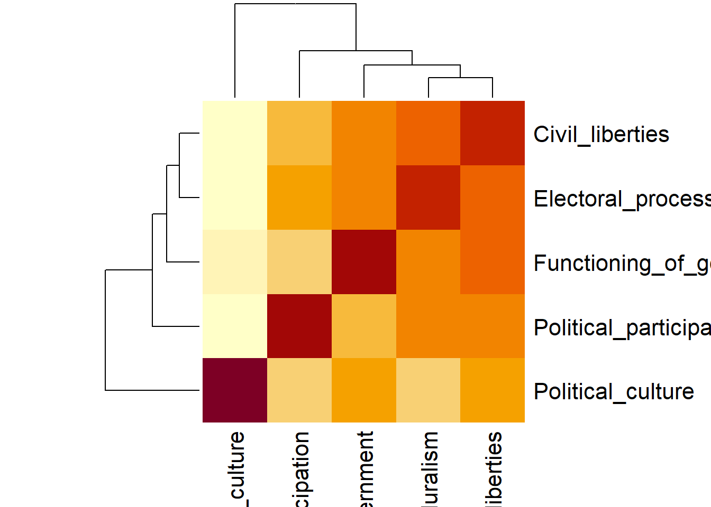

This is the heat map of the correlation of the components of democracy.

# 8.b. **Multiple linear regression**


```r
outlier_table <- total_data %>% select( Country,cia_gdp = `CIA.8..9..10. - Estimate` ,Electoral_process_and_pluralism,Functioning_of_government,Political_participation, Political_culture,Civil_liberties) %>% filter(! is.na(cia_gdp) & !is.na(Electoral_process_and_pluralism) & !is.na(Functioning_of_government) & !is.na(Political_participation) & !is.na(Political_culture) & !is.na(Civil_liberties))

democracy_gdp_model <- lm(formula = cia_gdp ~ Electoral_process_and_pluralism + Functioning_of_government + Political_participation + Political_culture + Civil_liberties, data = outlier_table)
summary(democracy_gdp_model)
```

```
## 
## Call:
## lm(formula = cia_gdp ~ Electoral_process_and_pluralism + Functioning_of_government + 
##     Political_participation + Political_culture + Civil_liberties, 
##     data = outlier_table)
## 
## Residuals:
##    Min     1Q Median     3Q    Max 
## -33113  -9146  -2288   7451  67080 
## 
## Coefficients:
##                                 Estimate Std. Error t value Pr(>|t|)    
## (Intercept)                     -15562.8     4635.4  -3.357 0.000985 ***
## Electoral_process_and_pluralism  -2969.7      893.8  -3.322 0.001108 ** 
## Functioning_of_government         4857.7     1040.2   4.670 6.37e-06 ***
## Political_participation            624.1     1094.7   0.570 0.569421    
## Political_culture                 2668.6      929.5   2.871 0.004647 ** 
## Civil_liberties                   2367.4     1327.2   1.784 0.076384 .  
## ---
## Signif. codes:  0 '***' 0.001 '**' 0.01 '*' 0.05 '.' 0.1 ' ' 1
## 
## Residual standard error: 16470 on 159 degrees of freedom
## Multiple R-squared:  0.459,	Adjusted R-squared:  0.442 
## F-statistic: 26.98 on 5 and 159 DF,  p-value: < 2.2e-16
```

```r
#of coefficients at α = 0.01
coef_alfa1 <- summary(democracy_gdp_model)$coefficients[summary(democracy_gdp_model)$coefficients[, "Pr(>|t|)"] < 0.01, ]
coef_alfa1
```

```
##                                   Estimate Std. Error   t value     Pr(>|t|)
## (Intercept)                     -15562.839  4635.4490 -3.357353 9.846470e-04
## Electoral_process_and_pluralism  -2969.651   893.8356 -3.322368 1.107560e-03
## Functioning_of_government         4857.747  1040.2283  4.669885 6.372662e-06
## Political_culture                 2668.625   929.4574  2.871165 4.647174e-03
```

```r
# finding the outliers
democracy_gdp_model$residuals <- resid(democracy_gdp_model)
out_liers <-  boxplot.stats(democracy_gdp_model$residuals)["out"]

cat("The countries with outliers are:", paste0(components[democracy_gdp_model$residual %in% out_liers[[1]], "Country"], sep =","),"\n")
```

```
## The countries with outliers are: Full democracies, Taiwan, Canada, El Salvador, Nepal, Niger, Mozambique, Democratic Republic of the Congo,
```

```r
outlier_table <- outlier_table %>% mutate(residual = democracy_gdp_model$residual) %>% arrange(residual)

head(outlier_table,5)
```

```
##            Country cia_gdp Electoral_process_and_pluralism
## 1            Benin    3300                            1.67
## 2       Cape Verde    6100                            9.17
## 3          Uruguay   22800                           10.00
## 4 Papua New Guinea    3700                            6.92
## 5            Kenya    4700                            3.50
##   Functioning_of_government Political_participation Political_culture
## 1                      5.71                    3.33              6.25
## 2                      7.00                    6.67              6.88
## 3                      8.93                    7.78              8.13
## 4                      6.07                    3.89              5.63
## 5                      5.36                    6.67              5.63
##   Civil_liberties  residual
## 1            4.41 -33112.70
## 2            8.53 -27825.97
## 3            9.71 -24858.59
## 4            7.35 -24525.83
## 5            4.12 -24321.28
```

```r
tail(outlier_table,5)
```

```
##                  Country cia_gdp Electoral_process_and_pluralism
## 161 United Arab Emirates   69700                            0.00
## 162              Ireland  102500                           10.00
## 163            Singapore  106000                            4.83
## 164                Qatar   92200                            1.50
## 165           Luxembourg  115700                           10.00
##     Functioning_of_government Political_participation Political_culture
## 161                      4.29                    2.22              5.63
## 162                      8.21                    8.33             10.00
## 163                      7.86                    4.44              7.50
## 164                      4.29                    3.33              5.63
## 165                      8.93                    6.67              8.75
##     Civil_liberties residual
## 161            2.35 42450.02
## 162            9.12 54402.18
## 163            6.47 59621.97
## 164            3.53 65918.29
## 165            9.71 67079.56
```

Things that can affect GDP besides democracy can be natural resources for example (in countries like Qatar, United Arab Emirates and Luxembourg).
